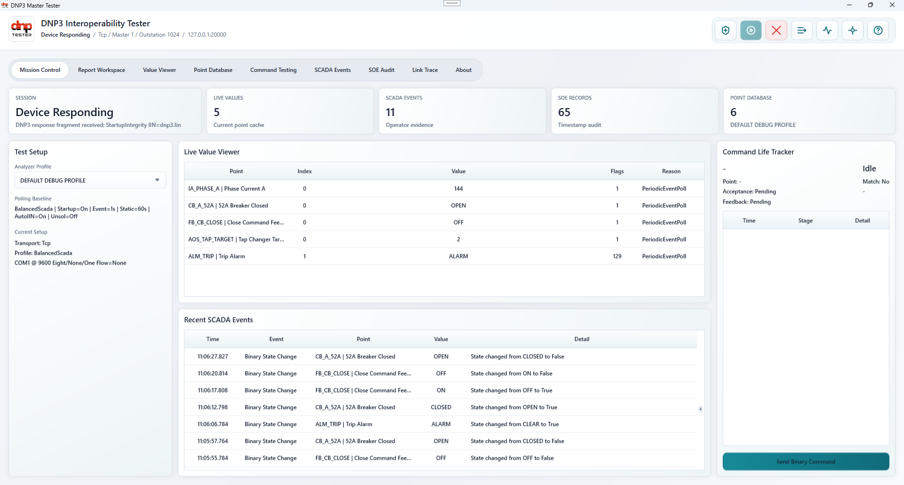
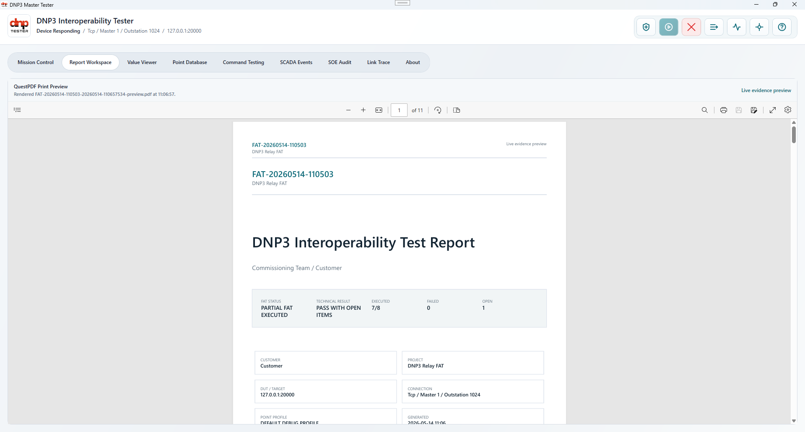
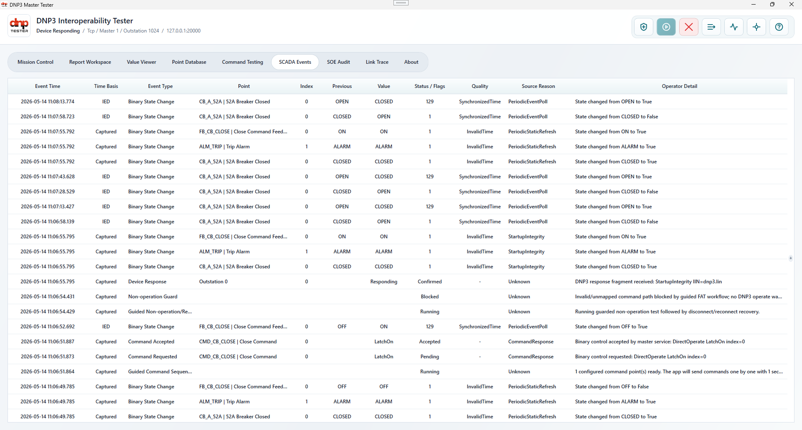
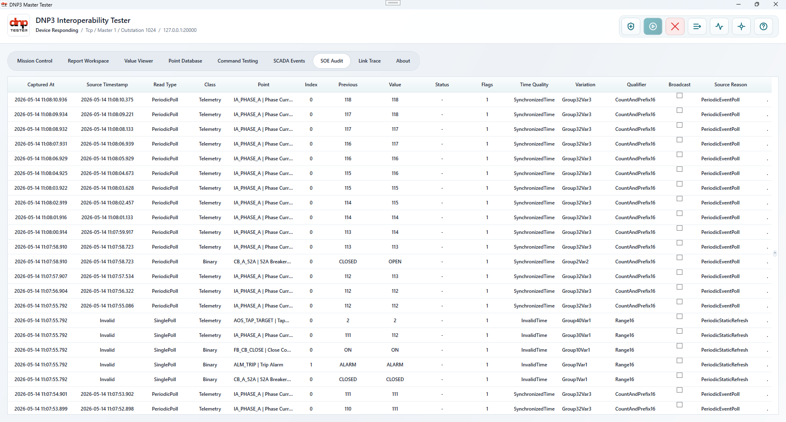

# Dnp3MasterTester

## Overview
`Dnp3MasterTester` is a WPF desktop DNP3 master-side test workspace for communicating with slave devices, especially protection relays over TCP and Serial.

It is built on top of the official Step Function IO `.NET` DNP3 package and is intended to evolve into a credible FAT / interoperability / audit tool.



Current focus areas:
- latest point state review
- SCADA-style event journal
- SOE / forensic callback evidence
- protocol/runtime diagnostics
- guided FAT report workspace and QuestPDF PDF export

## Status
The project is functional but still under active refinement.

What already exists:
- WPF operator shell
- TCP and Serial DNP3 master channels
- connection setup dialog
- workspace tabs for value/event/audit/trace review
- service-based integration with official Step Function DNP3 engine
- real device-response evidence state, separate from open socket state
- guided report workspace with PDF preview/export
- command lifecycle evidence and FAT snapshot builder

What still needs major work:
- more credible polling/interoperability strategy
- better relay-profile behavior
- deeper negative-test and recovery-test automation
- profile-specific validation and report observations

## Technology
- `.NET 8`
- WPF
- Step Function IO `dnp3` package
- native `dnp3_ffi` payload

## Main surfaces

### `Value Viewer`
Shows last known state per point.

### `SCADA Events`
Intended for operator-facing event journal rows such as:
- binary state changes
- command events
- device response evidence
- guarded non-operation and recovery workflow events

### `SOE Audit`
Shows more callback-derived detail for forensic review.

### `Link Trace`
Shows protocol/runtime diagnostics and engine trace information.

### `Report Workspace`
Guides report identity, verification steps, automated FAT evidence capture, and
QuestPDF preview/export.

## Screenshots

### Report Workspace



### SCADA Events



### SOE Audit



## Project structure

Important files:
- [MainWindow.xaml](MainWindow.xaml)
- [ConnectionSettingsWindow.xaml](ConnectionSettingsWindow.xaml)
- [ViewModels/MainViewModel.cs](ViewModels/MainViewModel.cs)
- [Services/Dnp3MasterService.cs](Services/Dnp3MasterService.cs)
- [Services/Reports/FatReportSnapshotBuilder.cs](Services/Reports/FatReportSnapshotBuilder.cs)
- [Services/Reports/QuestPdfReportExportService.cs](Services/Reports/QuestPdfReportExportService.cs)

## Build

```powershell
dotnet build DNPTester.slnx
```

## Development notes

### Use the official engine only
Do not replace the Step Function engine with a custom protocol stack.

### UI should stay passive
The UI layer should display and organize evidence, not invent protocol behavior.

### Polling is currently the highest-value improvement area
If relay changes only appear after manual integrity, treat that as a protocol/interoperability issue first, not merely a UI issue.

## Recommended reading order
1. `AGENTS.md`
2. `PROJECT_CONTEXT.md`
3. `project_tree.md`
4. `project_data_flow.md`
5. `project_summary.md`
6. `Services/Dnp3MasterService.cs`
7. `MainWindow.xaml`

## Goal
The goal is to turn this repository into a DNP3 master-side relay audit tool that is:
- credible
- readable
- interoperable
- useful in real FAT and troubleshooting workflows
